# Harmony: An App for Music Learning (Vanessa Ta)

## Introduction: a brief information about the project. 
The premise of this project is to simplify the feedback process, and provide a platform for these students to upload audio or video recordings of themselves for evaluation. Instructors or even intermediate students could give feedback of what could be improved during the recordings. Our user-search saw that this reviewal system could be quite helpful. The personas include the student, the evaluator, and the parent, and each persona has a unique view of the app. In this case, we will be focusing on the view of the student. The usage scenario imagines a student organizing and interacting with their own portfolio, a collection of recordings throughout their musical journey. We will be focusing on the following features: 
The ability to play a recording.
The ability to filter through recordings by certain criteria.
The ability to record and edit a performance.
The ability to organize one’s portfolio by creating folders

## Clear design statement: 
Overall, these students may not have access to a lot of resources, such as finding a ride to the location the music artist is at. Additionally, these students may have other commitments they have to abide to and may find it difficult to find time to go to these lessons. These factors contribute to an overall lack of engagement, as students will most likely find it difficult to focus if they cannot attend class as often or are worried about more pressing issues. 

My app will provide a platform for these students to upload audio or video recordings of themselves for evaluation. Ideally, my project would partner with local school districts who already have music programs to provide additional support, as these schools may be short staffed/lack resources to give each student individual support.

## Competitor analysis [assignment01 & 02]:
While starting this project, my focus had been a bit broad and I focused on student learning generally. I conducted a heuristic analysis of Trello and CCLE, both academic planning apps for students. My findings could have been more helpful if I had a more focused idea of my project earlier on, however it was still helpful to see how students organize their tasks generally, as this sort of behavior is common through all types of learning. 

In summation, CCLE was of much poorer quality than Trello. Organization was a huge hinderence in the app, and there was a lot of nested information and links to get to. The user was given very little autonomy, which was very frustrating when it came to the calendar and reminders feature. It was also unnecesarily cluttered, and as a user it was difficult for me to imagine what the primary use of the app should be. Trello, however, was much more polished, but was a bit confusing to use due to its overwhelming list of features. However, it outperformed CCLE in aesthetics and in user autonomy. It was also interesting in the sense that Trello offered more features, yet was still less cluttered than CCLE.

### Trello
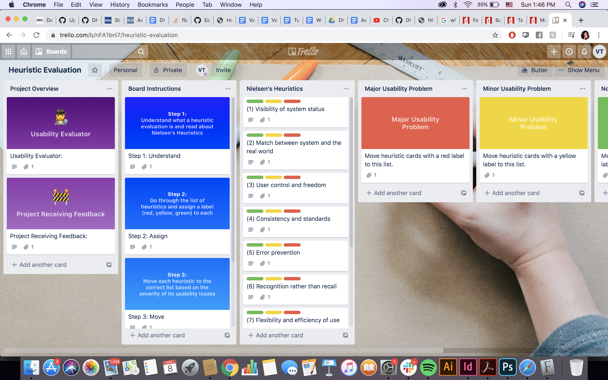

### CCLE
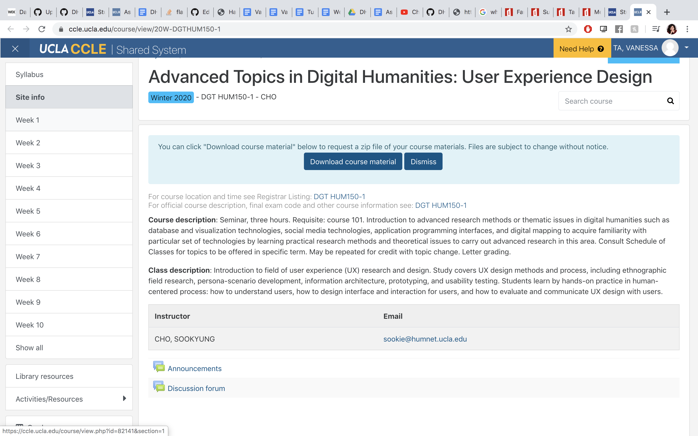

### User walk through
[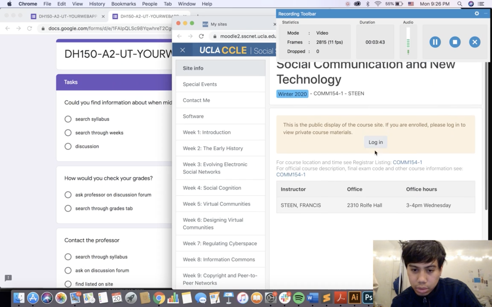](https://www.youtube.com/watch?v=DGdK7GRPBBg)

### Read More [Full Competitor Analysis](https://vcta99.github.io/DH150/assignment01)

## User research [contextual inquiry, assignment04]:
I formally interviewed two users from two target demographics, one who was professionally trained (plays in the UC San Diego orchestra), and one who plays music casually. My goal was to learn about their own music journeys, and to see how efficient it could be to evaluate a performance via video. Interestingly enough, my user research confirmed that visuals were just as important as audio in evaluating a musician’s performance, which I found to be unexpected. The rationale being that posture, embouchure, and overall body placement is integral to music playing, and that while one can ‘listen’ for wrong notes, it is difficult to correct unless you visually see what the player is doing to cause the wrong notes. I had originally planned to support audio only files on the app, so this was a welcome revelation.

### Read More [Full User Reserach](https://vcta99.github.io/DH150/ASSIGNMENT_04)

## UX storytelling [persona+scenario, assignment05]
I developed three personas for this app, the student, the evaluator, and the parent. Since our app’s target demographic was younger kids wanting to learn how to play music, I thought it was worthwhile to include accounts for parents to monitor their child’s process. I developed three scenarios, one for each user: recording performances, accessing performances, and evaluating performances. 

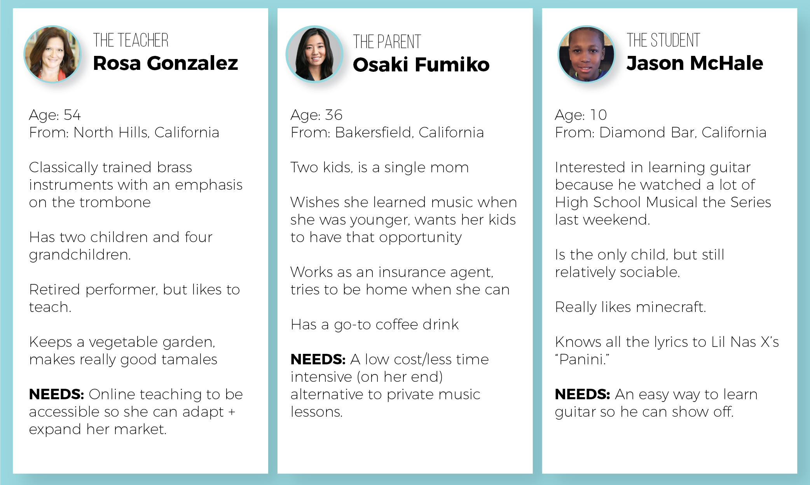

### Read More [Full UX Storytelling](https://docs.google.com/document/d/1pRCts9UONrtibUF1LR1w_9zvTd58NjbpCZb22IOHt2E/edit?usp=sharing)

## Wireframe and graphic design element variation [assignment07 + part of 08]

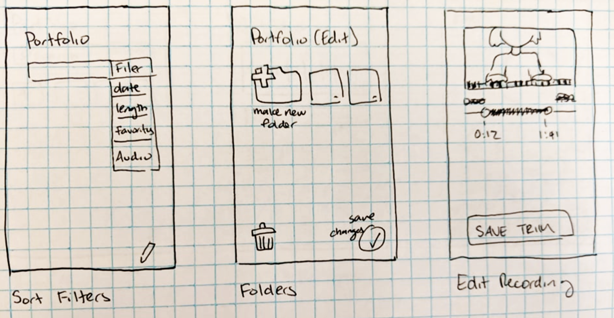
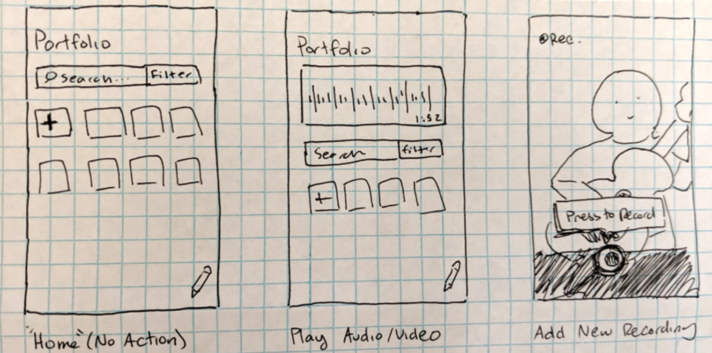

## Low-fidelity prototype (wireflow, assignment07)
I created a low-fidelity prototype of the students ‘portfolio’, where the user would upload their recordings. These recordings would then be evaluated by the professor, but would also be viewable by their parents (but their parents would not be able to leave feedback). I did test the wireflow, and the test user’s expectations mostly matched what I had designed. One interesting note was that the test user expected some features to always be accessible (ie. that one could edit their recording even after it had been uploaded). Although that was not how I initially conceptualized the design, I thought it made logical sense, and noted that for the next iteration.

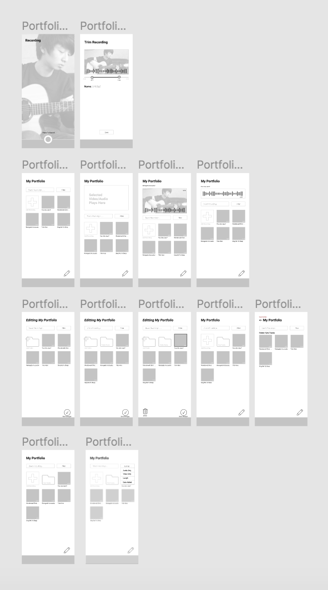

## High-fidelity prototype
My design targets a younger user group, so I wanted the color scheme and font to reflect that. I chose brighter colors to give a sense of playfulness, and a rounded font as a header to give a friendlier, younger look. I kept squares with rounded corners and tried to keep most components rounded to keep with a cuter, friendlier feel.

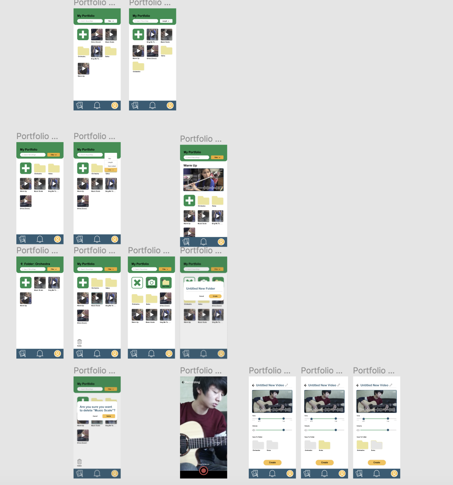
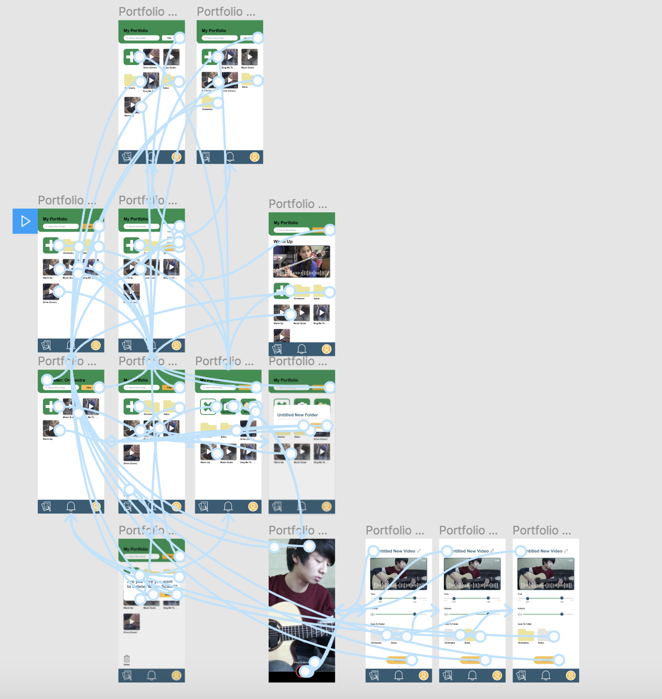

[Interactive Prototype](https://www.figma.com/proto/dwtQhWag9RkM8AIiQlkv0N/Hi-Fidelity-Wire-Frames?node-id=2%3A1&scaling=min-zoom)

## Optional evaluation and revision history 
As noted previously, I did conduct an accessibility audit on my high-fidelity prototype. The bright blue I used initially did not have high enough contrast (I used the Stark plugin on Figma to measure this). As a result, I changed the bright blue to a deep green, and adjusted the remainder of the design accordingly. 
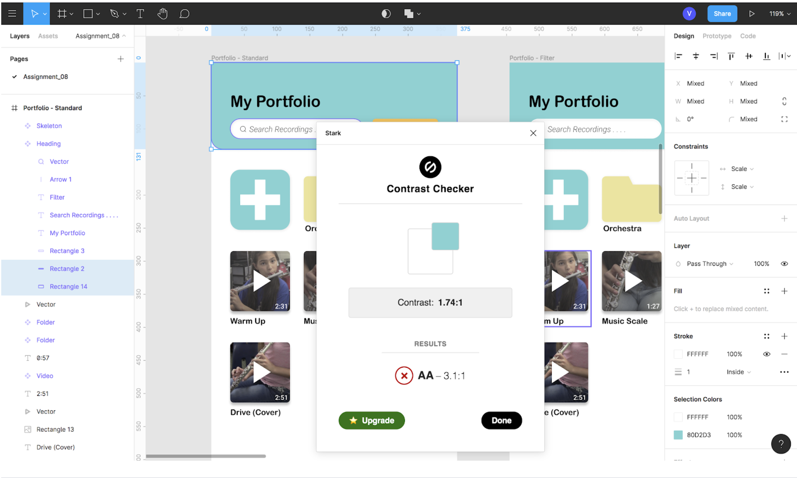
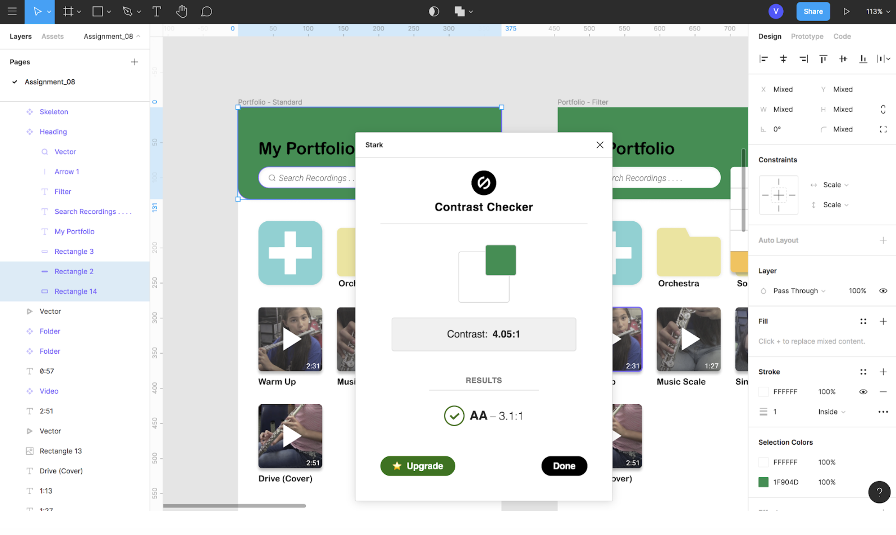

I also conducted a heuristic evaluation, available for view on my figma file:

### Read More [Heuristic Evaluation(Figma)](https://www.figma.com/file/dwtQhWag9RkM8AIiQlkv0N/Hi-Fidelity-Wire-Frames)
##### 1. Visibility of system status 
Lacking, could be improved by creating a loading bar for the video.

##### 2: Match between system and the real world
Good! The recordings can be organized into the folders, mimicking how the user usually organizes their work into subcategories.

##### 3. User control and freedom
Quite good, the user can edit certain aspects of the performance before turning it in.

##### 4: Consistency and standards
All colors and fonts are stylistically consistent, however some sharper edges exist (ex. the 'playback' sign) that don't match the rounded aesthetic.

##### 5: Error prevention
Error prevention does not exist, but could be implementing here. The app could prevent you from uploading a video that is too short (say 0-1 seconds), or one that is mute.

##### 6: Recognition rather than recall
Although not specifically stated, the search bar would try to "fill in" whatever you are searching for, which would help when the user cannot remember the exact name of recording.

##### 7: Flexibility and efficiency of use
Overall, I feel the app to be quite efficient to use, as all application uses are quite easily accessible.

##### 8: Aesthetic and minimalist design
The design remains uncluttered, and contains no unnecessary elements.

##### 9: Help users recognize, diagnose, and recover from errors
Agains with the search bar, it maybe helpful to have suggested results (ie. did you mean _____) to help the user recover from errors of misspelling.

##### 10: Help and documentation
I have not included any help and documentation, but creating a basic tutorial of sorts that one can refer back to would be extremely helpful for future iterations.

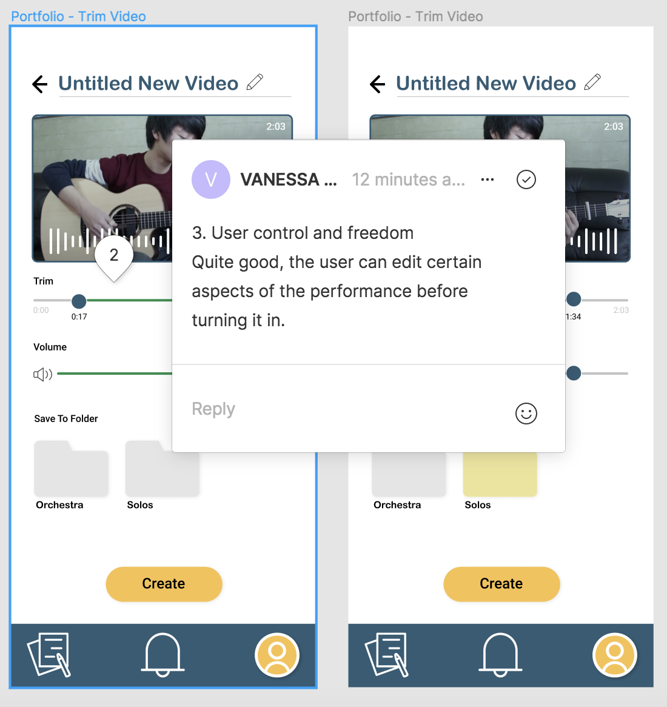
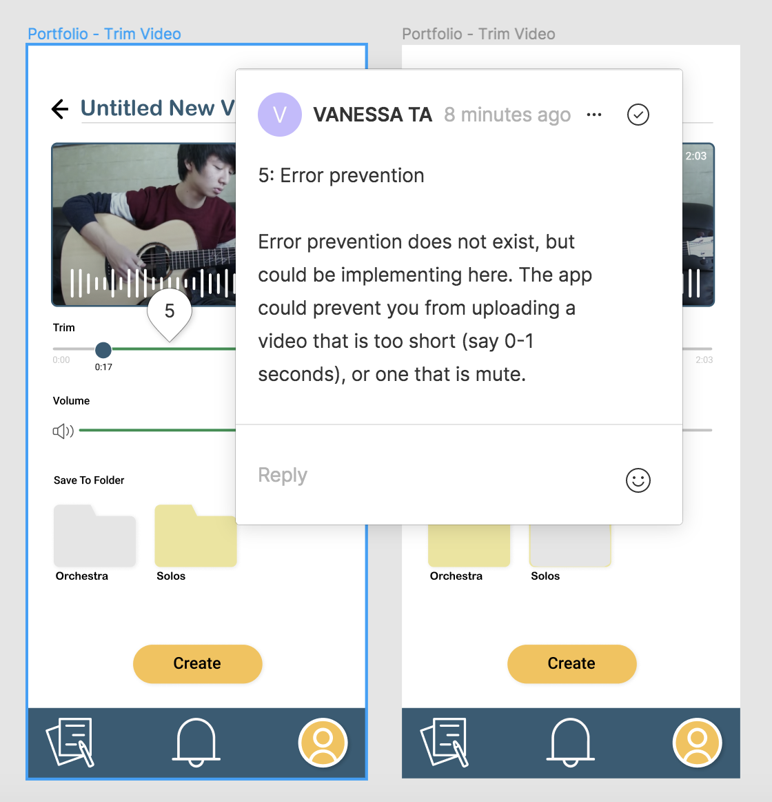
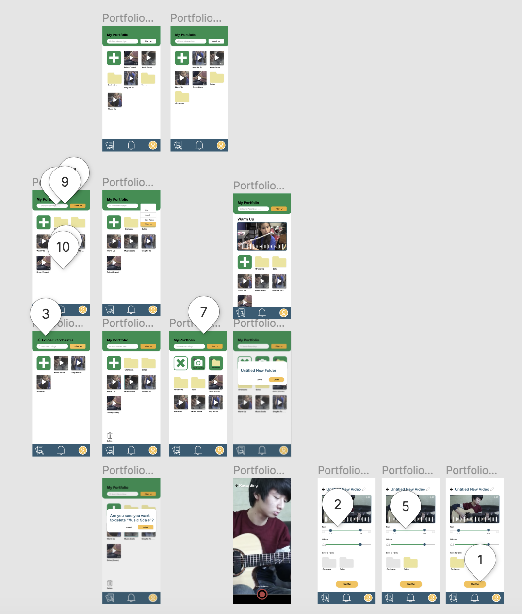

### I made some improvements based on my evaluation . . .

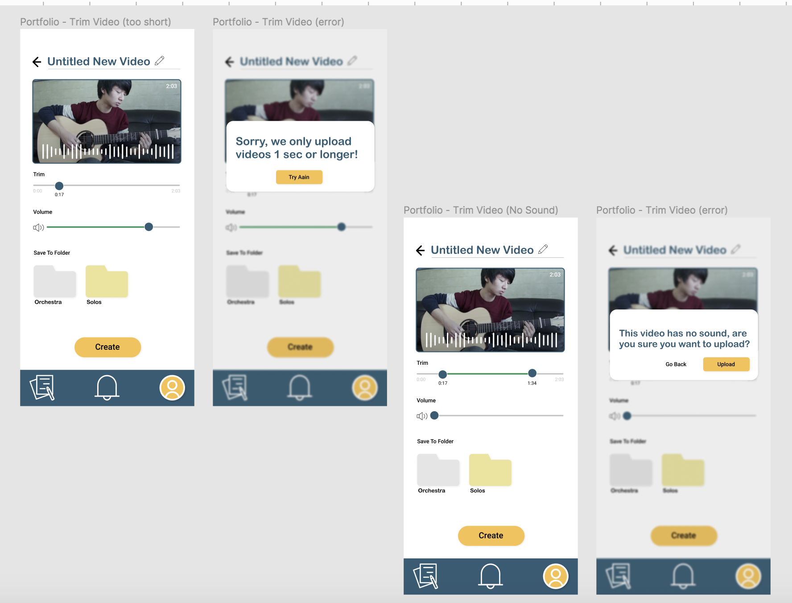

## Pitch video

## Conclusion
If I was given more time, I would like to conduct user research on how musicicans learn different instruments (wind vs string vs percussion, etc.) Right now my application serves a general audicence, but I believe that knowing these differences could help tailor the user journey to the needs of different instrument players. It was also a challenge to conceptualize my own app from scratch, rather than improving on an existing one, as there were many other fundamanetal features of the application that I did not have time to design. I am quite satisified with what I was able to produce given the cirucumstances, however and would love to further build on what I already have. 

