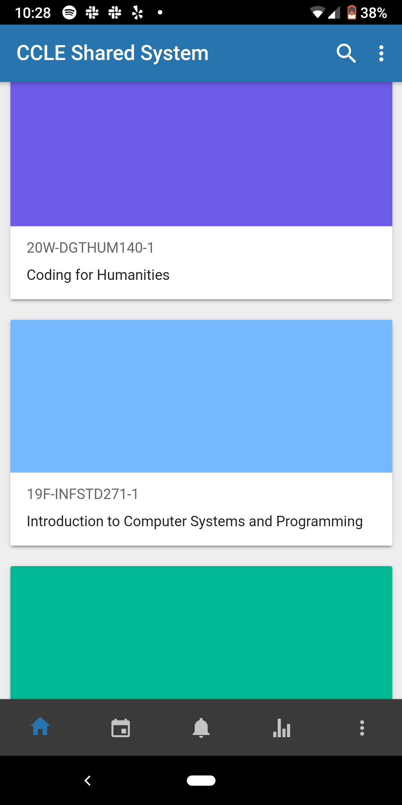
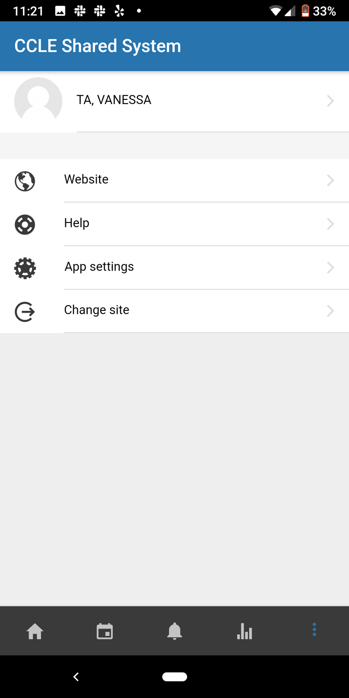

# Services for Students: CCLE and Trello

## Motivation + Description
I will be conducting a heuristic evaluation of CCLE, or Common Collaboration and Learning Environment, a service offered by UCLA to the student body. CCLE exclusively serves the community of UCLA students, and exists both on desktop and on mobile. I will be reviewing the mobile version, as I see a lot of potential for the app's use (CCLE is one of my most visited sites on desktop), yet I don't see many of my peers using it. My peers are always on the go, and need to be constantly on track of assignments and other test dates, so finding ways to improve the app could also improve the general workflow of students.

I will also be conducting a usability testing on Trello, one of the more popular productivity application on campus. I know several friends use the website. I personally do not, but will be making an account for the purpose of this assignment. The community also serves students, and has been extremely helpful for users to keep track of their responsibilites.

Information about the web/app for the first heuristic evaluation
[CCLE](https://ccle.ucla.edu/my/)
[Trello] (https://trello.com/)

## Overall Impression:
### CCLE
The app more resembled a text document than it did an app. Organization was a huge hinderence in the app, and there was a lot of nested information and links to get to. The user was given very little autonomy, which was very frustrating when it came to the calendar and reminders feature. It was also unnecesarily cluttered, and as a user it was difficult for me to imagine what the primary use of the app should be.

### Trello
This dekstop application was much more polished, but was a bit confusing to use due to its overwhelming list of features. However, it outperformed CCLE in aesthetics and in user autonomy. It was also interesting in the sense that Trello offered more features, yet was still less cluttered than CCLE.

## 1: Visibility of system status
### CCLE
Severity rating: (3)
There are two places where visibility of system statuses could be used, but aren't. The first is in the submission process when turning in assignments. There is no clear indication of the number of steps this process would take, nor any signal to the user of where they are in the process.

This could also be used for the 'class progress'. The app separates classes into three categories: 'Future', 'Past', 'In-Progress', but visually these elements appear the same.

### Trello
Severity Rating: (1)
Trello does have pre-set cards that label the state of each task, and you can also check off tasks once you have completed them. Once you have checked off these tasks, the card will update with how many tasks you have left to complete until the entire objective is complete. However, it is up to you to input your own tasks.

## 2: Match between system and the real world
### CCLE
Severity rating: (2)
In general, the app does an adequate job of matching the real world. The language used is quite consistent, 'Grades', 'Reminders', etc. Some symbols, like the 'all courses' use a symbol that is not inherently a reflection of the real world. 

### Trello
Severity Rating: (1)
Trello does, to me, resemble post it notes and lists on a corkboard. The subject of the assignment is on the top (say, DH 150), and followed vertically by the list of assignments you must complete. You can also organize your boards depending on different areas of your life (by class, or separated by class vs. work life, etc.) However, Trello does not have options to manipulate text, such as highlighting or crossing names out. This does not match the real world, as I do this a lot with my planners to indicate importance/completeness.

## 3: User control and freedom
### CCLE
Severity rating: (3)
There is very little user control on this application. All calendar events and reminders can only be set by the professor, not by the students. There is also no way of 'canceling' or marking reminders as 'done', which can be frustrating for the student.

### Trello
Severity Rating: (0)
User autonomy is incredibly high. The interface is customizable in almost every aspect (color, names of labels, sharing settings, etc).

## 4: Consistency and standards
### CCLE
Severity rating: (1)
In general, all fonts, colors, and buttons are stylistically similar. However,the color of the card that represents the class is not consistent with any other header of feature, and is not used anywhere else on the app. The color seems arbitrary, and may cause confusion for the user. Another area of confusion is that there are two distinctly different features on the bottom that have the same name.

### Trello
Severity Rating: (1)
Each board resembles the next board in terms of features and styling, but can be difficult to exactly replicate due to the level of customization. So some boards may have added features by the users that other boards do not. However, Trello does offer a ‘duplicate board’ feature that carries all features from one copy to the next.

## 5: Error prevention
### CCLE
Severity rating: (2)
The submission feature offers a mans to edit your submission, which is helpful, but does not necessarily prevent you from making the error in the first place. In general, the user doesn't have much autonomy, so the user does not have much room to make errors.

### Trello
Severity Rating: (2)
The Trello app does allow you to create due dates for tasks, but does not stop you from making the due date in the past. Of course, this does resemble real life (sometimes you have to work on things that are already due), but seems a bit strange. The user may input a date from the past on accident and have to change it in retrospect.

## 6: Recognition rather than recall
### CCLE
Severity rating: (0)
This app relies heavily on recognition, which offers a pleasant experience for the user. All course and assignments are listed out, and rarely do I find myself having to use the search feature provided. This was one of the rare things that I had little problems with. However, some of the information was incorrect (but this is not necessarily a design issue).

### Trello
Severity rating: (0)
The Trello app has an excellent search feature, that lets you search by color of label, by date due, etc. The search feature also includes autofill and will search through cards as you input the search, not after you complete it, so you can see your results narrowing down.

## 7: Flexibility and efficiency of use
### CCLE
Severity rating: (3)
The app is very difficult to use, mostly because of the implementation of the skeleton feature on the bottom. There are five features: 'CCLE Shared System', 'Calender events', 'Notifications', 'Grades', 'CCLE Shared System'. However, the contents of 'Calender events', 'Notifications', 'Grades', are contigent on which course you choose, but you choose the course in 'CCLE Shared System', which can be a bit confusing. 

### Trello
Severity Rating: (2)
Although I have been using Trello for a short period of time for this assignment, I am still a bit confused on how to best go about my organization. Having presets or templates would be helpful. However, the app is very flexible in use, which is good, but many choices can be overwhelming for the user. 

## 8: Aesthetic and minimalist design
### CCLE
Severity rating: (3)
The app is extremely cluttered. The font size is on the smaller side and a bit difficult to read. There is a default grey background, which isn't inherently bad, but makes the app seem very dull. To make matters worse, multiple shades of grey are used, and it is difficult for any one feature to pop out. 

### Trello
Severity Rating: (0)
Very pretty! Pleasant use of colors and designs are relatively minimalistic. 

## 9: Help users recognize, diagnose, and recover from errors
### CCLE
Severity rating: (1)
Again, there is very little autonomy given to users, so it is difficult to set up opportunities for users to recognize and recover from errors. There are grades, but these are not necessarily errors on the applications part.

### Trello
## 9: Help users recognize, diagnose, and recover from errors
Severity Rating: (0)
Super pleasant! The login feature tells you exactly where the error is (wrong password, password not set, etc.)

## 10: Help and documentation
### CCLE
Severity rating: (3)
A help feature does exist, but it is incredibly inefficient, as it redirects you to a link that opens up on your internet browser,rather than in the app. The link you are directed to is stylistically different from the application itself, and once you are in your browser there is no natural way in which you can go back to the application, disrupting user flow.

### Trello
Severity Rating: (2)
There is a ‘butler’ feature, which is meant to help you improve your Trello board. However, the feature depends on some familiarity with the app before hand, and does not break each function down for the user. The app does, however, have tutorial slides that go over each feature, but this tutorial is not readily available after the first viewing. Indeed, I had a bit of trouble and was overwhelmed by the many features on the application.

