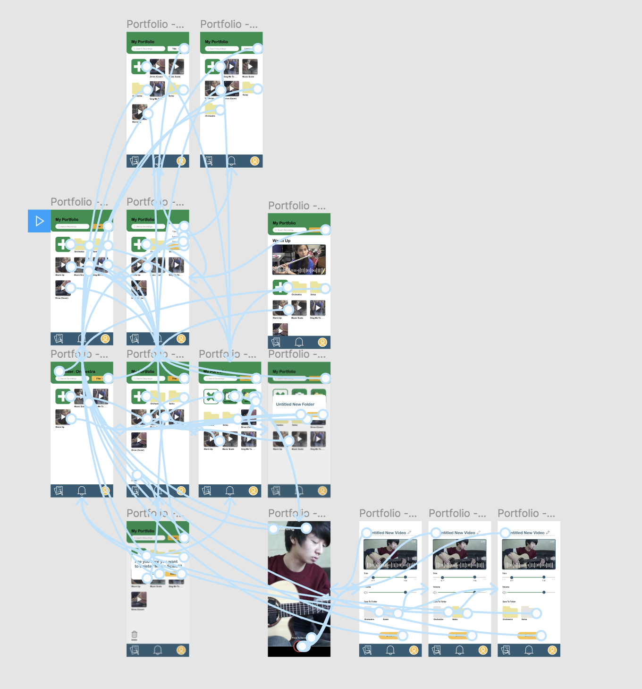
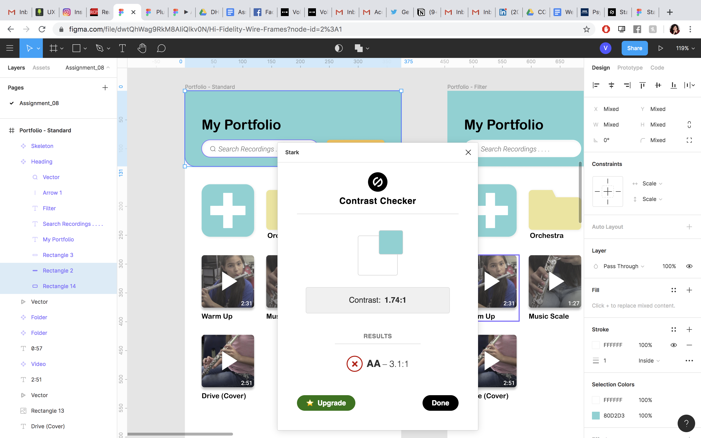
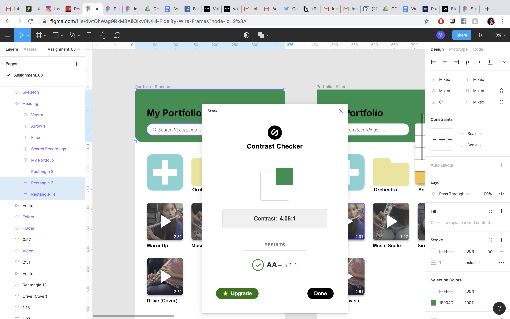
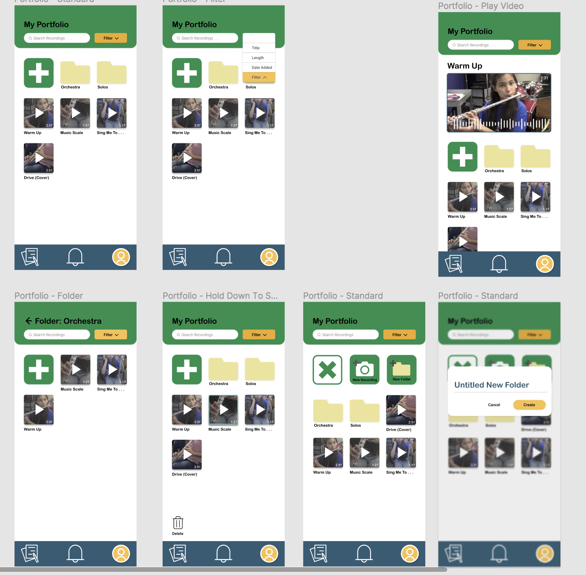

### Link to prototype: 
https://www.figma.com/proto/dwtQhWag9RkM8AIiQlkv0N/Hi-Fidelity-Wire-Frames?node-id=2%3A1&scaling=min-zoom

### Description of project
The premise of this project is to simplify the feedback process, and provide a platform for these students to upload audio or video recordings of themselves for evaluation. Instructors or even intermediate students could give feedback of what could be improved during the recordings. Our user-search saw that this reviewal system could be quite helpful. The personas include the student, the evaluator, and the parent, and each persona has a unique view of the app. In this case, we will be focusing on the view of the student. The usage scenario imagines a student organizing and interacting with their own portfolio, a collection of recordings throughout their musical journey. We will be focusing on the following features: 
1. The ability to play a recording.
2. The ability to filter through recordings by certain criteria.
3. The ability to record and edit a performance.
4. The ability to organize one’s portfolio by creating folders.
The purpose of this high fidelity prototyping is to run through the full interactivity of the portfolio feature and to develop a cohesive style system

### Designs
My design targets a younger user group, so I wanted the color scheme and font to reflect that. I chose brighter colors to give a sense of playfulness, and a rounded font as a header to give a friendlier, younger look. I noticed, however, that the bright blue did not have high enough contrast (I used the Stark plugin on Figma to measure this). As a result, I changed the bright blue to a deep green. I kept squares with rounded corners and tried to keep most components rounded to keep with a cuter, friendlier feel. 

### Wireflow with graphic design

### Screen Designs

